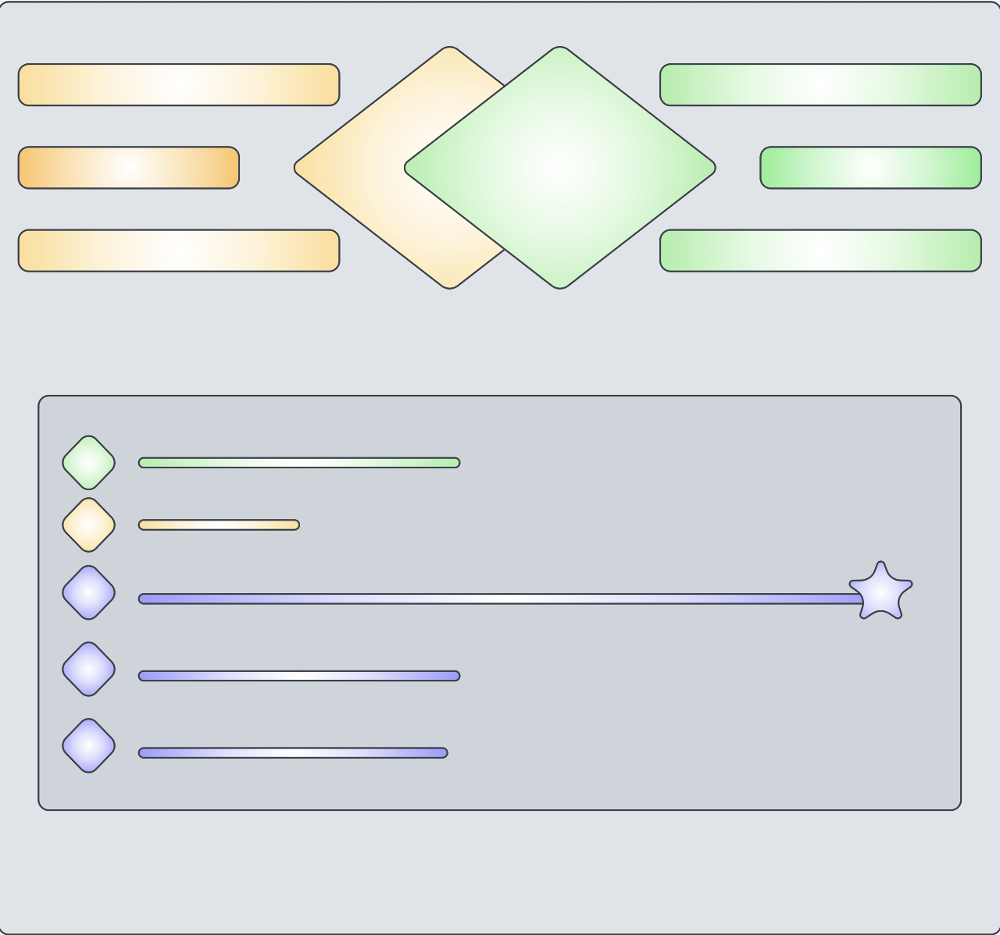
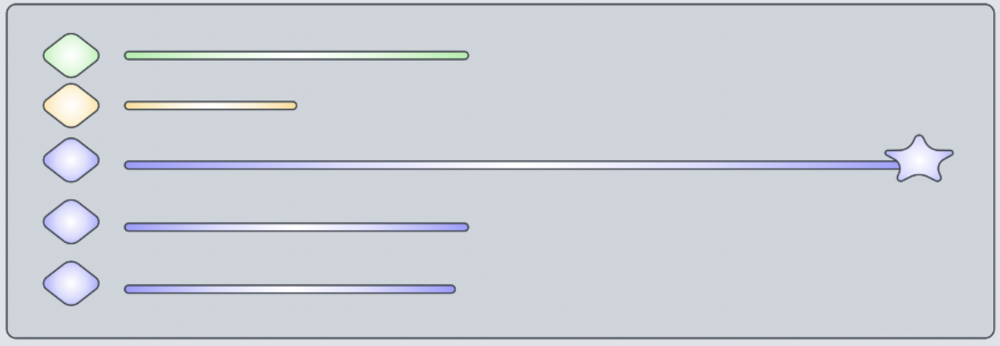
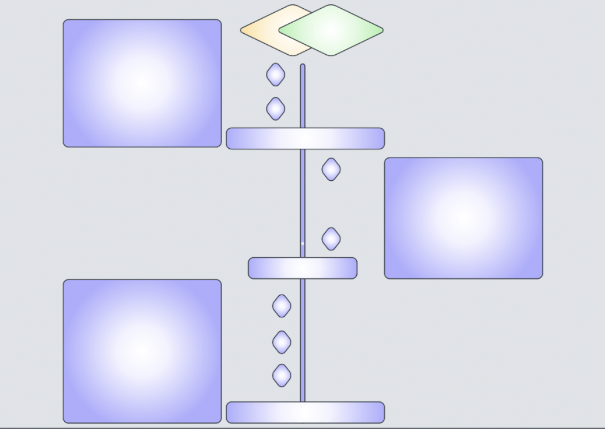
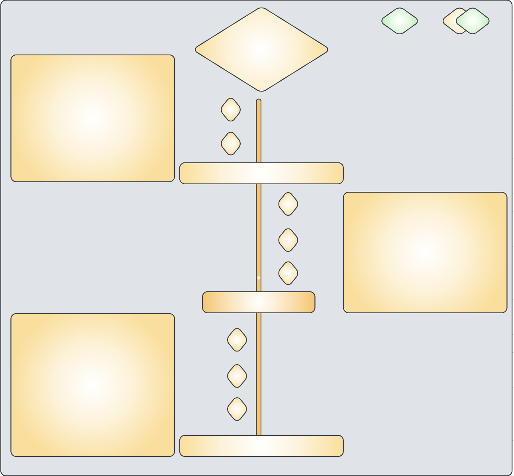
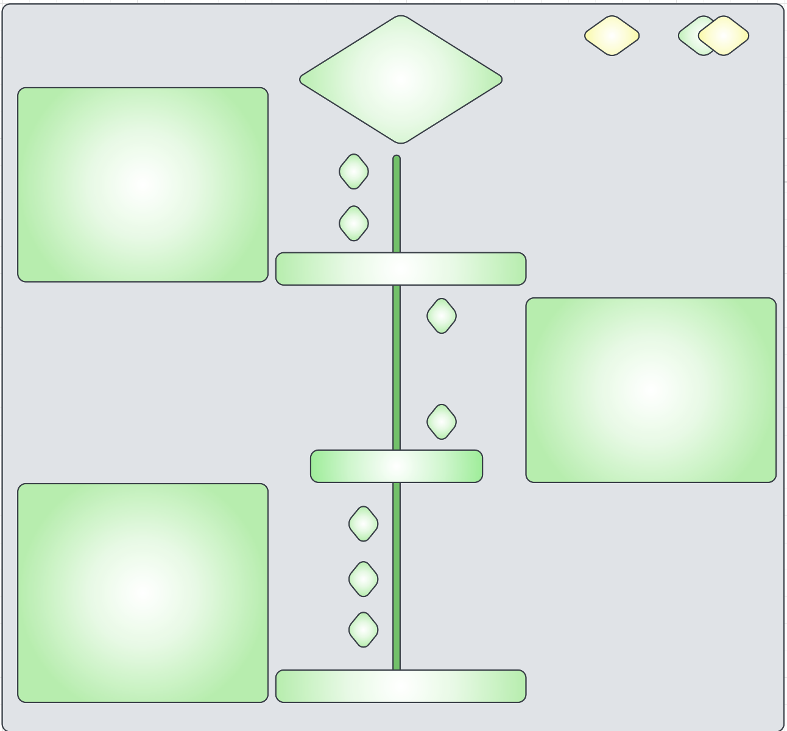

# GoalTracker

## Description
Trying to create a website where we keep track on our goals through life.
Where do we see ourselves in 1 year, 5 years, 10 years etc.
How do we get to that goal, what do we need to do to?
Setting a few smal goals on one part of the page that eventually will lead up to reach the bigger ones and mark it as done.

Breaking this down:
There will be 5 main goals (option to add more later on).
Each induvidual of these "5" goals will have a few smaller goals under it.
Representing everything we need to do to reach that big goal.
Once reaching one big goal it will unlock, alowing you to move on to the next big goal and so it will go on.

## User Experience
* First Time Visitor Goals
    * As a first time visitor, I want to easily understand the websites purpose and read more about it.
    * As a first time visitor, I want to understand the purpose of the websites conent.
    * As a first time visitor, I want to navigate fast and easily on the site to find what I´m looking for.

* Returning Visitor Goals
    * As a returning visitor, I want to easily navigate to the menu to find what I´m looking for.
    * As a returning visitor, I want to find the links easily and take me to the right place.
    * As a returning visitor, I want to get an overall view of all the different goals and how far along they are.

* Frequent User Goals
    * As a Frequent visitor, I want to be able to add more small goals and set new big ones up as well.

## Features
F1, Navigation & logo
    
    The navigation bar is easy to navigate through on all devices.
    You got the yellow/green logo in the middle representing "Pisen" & "Szymon".
    The logo will contain a link to take you down to look closer into the goals we have together.

    On "Pisen" (Yellow) side there will be three menu options.
    On "Szymon" (Green) side there will be three menu options as well.

    A quick overview of our goals togheter and our seperate goals.
    The overview will be visible on the top of home page & at the bottom of "Pisen" & "Szymon".
* 

F2, First section (Overview of all goals)

    Here we can see how far "Pisen", "Szymon" & "Our" goals are on bars.
    If one of these bars are full a star will show up at the end of the line.
    A small picture in the beginning to make it a little more personal & showing who the bar is for & for what.
* 

F3, Second section (Our goals)

    Here we can se a timline going down in the middle, top is where we are now.
    The small goals are displaying on both sides, leading up to that big goal.
   
    When hovering over the small goal a pop up box appears with text explaining what you need to achieve.
    When you click the small goal it will change color (You achieved this goal now).
    The closer you get to the end you will change more colors & reach more goals.
* 

F4, Other pages ("Pisen", "Szymon")

    These two pages are designed the same way as the second section, only these are specified on either "Pisen" or "Szymon" when it comes to text content.
    Another feature is the navigation on these pages changes to be one logo displaying only "Pisen" or "Szymon".
    On the side we have buttons that will take you to either "Pisen" or "Szymon" or the home page. Some color differences here to personalize the pages.
* 
* 

F5, Buttons & hover

    Buttons are created for when a goal's been achieved.

    When hover over the buttons a small box will appear on the side of the page.

F6, Javascript

    Using javascript to change color of the buttons when clicked & appear a pop up box when buttons are being hovered.